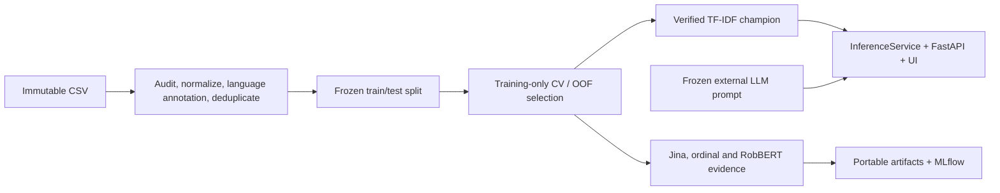

# Dutch Movie Review Sentiment

A production-minded sentiment-classification project for Dutch-primary movie reviews. It trains one
shared model on all supplied Dutch and English rows, serves a verified TF-IDF champion through
FastAPI, and preserves classical, embedding, transformer, ordinal, and LLM experiment evidence in
portable artifacts and MLflow.

The project prioritizes reproducibility, minority-class behavior, honest evaluation, and a small CPU
serving path over selecting the largest model.

## Project at a glance

- Input: 4,800 supplied reviews; two normalized duplicate extras removed.
- Fixed split: 3,838 training rows and 960 test rows.
- Production/UI model: class-balanced word + character TF-IDF Logistic Regression.
- Optional UI comparison: frozen 24-shot external LLM advisor.
- Research models are visible as evidence but are not loaded by the production service.
- No genuinely new blind dataset currently exists; the final ranking reuses the fixed test split.

> **Interview summary:** [Open the one-page A4 experiment report (PDF)](reports/sentiment_final_one_page_report.pdf)
> for the data flow, seven-model ranking, operating metrics, and governance decision at a glance.

## Language scope decision

The original brief asked for Dutch-only reviews, but the supplied CSV also contains 485 consistently
detected English reviews. The project therefore tested whether retaining them would affect the
primary Dutch result.

| Training scope evaluated on Dutch rows | Accuracy | Macro-F1 | Negative F1 |
| --- | ---: | ---: | ---: |
| Dutch-only baseline | 0.6477 | 0.6311 | 0.5918 |
| Shared Dutch + English model | 0.6489 | 0.6381 | 0.6139 |

- **Empirical check:** Dutch accuracy changes by only +0.0012 and Macro-F1 by +0.0071. Retaining
  English does not materially degrade the Dutch benchmark, although this is not evidence that
  English supervision is intrinsically superior.
- **Shared signal:** Dutch and English are West Germanic languages using the Latin script. Word and
  character TF-IDF can reuse cognates, borrowed sentiment terms, punctuation, rating expressions,
  and character patterns without treating the languages as interchangeable.
- **Data sufficiency:** a separate English model would have only 388 training rows and eight English
  Negative examples. One shared model uses all supplied data while language-specific metrics remain
  visible.

English predictions carry an explicit reliability warning. Other confidently detected languages
remain unsupported.

## Final model comparison

| Rank | Presentation model | Macro-F1 | Accuracy | Governance |
| ---: | --- | ---: | ---: | --- |
| 1 | LLM few-shot (24-shot) | 0.7506 | 0.7208 | External advisor |
| 2 | Jina Ordinal | 0.7104 | 0.6896 | Research only |
| 3 | Jina Logistic | 0.6715 | 0.6719 | Research only |
| 4 | RobBERT v2 Improved Ensemble | 0.6615 | 0.6771 | Challenger evaluation |
| 5 | TF-IDF Ordinal | 0.6406 | 0.6500 | Frozen challenger |
| 6 | TF-IDF Logistic | 0.6379 | 0.6531 | Production benchmark |
| 7 | RobBERT v2 Logistic | 0.6252 | 0.6354 | Test evidence |

See [`reports/final_model_comparison.md`](reports/final_model_comparison.md) for all metrics and
[`docs/MODEL_GOVERNANCE.md`](docs/MODEL_GOVERNANCE.md) for lifecycle and deployment boundaries.

## Architecture



Normalization, TF-IDF features, and classification are serialized in one sklearn pipeline. Language
identification remains outside the pipeline so the API can report language and attach an English
reliability warning. The complete system and module diagrams are in
[`docs/ARCHITECTURE.md`](docs/ARCHITECTURE.md).

## Repository map

```text
src/dutch_sentiment/             API, service, CLI and stable production modules
src/dutch_sentiment/models/      model-family implementations
src/dutch_sentiment/experiments/ shared experiment mechanics and research orchestration
configs/models/                  one canonical configuration per model family
artifacts/model.joblib           verified production pipeline
artifacts/model_metadata.json    hashes, versions, split, metrics and schema
artifacts/model_release.json     champion/source-run release binding
artifacts/final_models/          aligned seven-model comparison evidence
reports/                         generated audits and experiment reports
tests/                           deterministic unit and API tests
notebooks/                       Colab entry points for GPU experiments
```

## Installation

The verified serving and development runtime is Python 3.11.

```bash
python3 -m venv .venv
.venv/bin/python -m pip install -e '.[train,dev]'
```

`make install-locked` reproduces the recorded macOS x86_64 Python 3.11 environment. Portable
dependency groups in `pyproject.toml` remain authoritative for other platforms. Embedding and
RobBERT experiments require their documented optional dependencies and normally run on Colab GPU.

### Evaluator quick start

Clone the repository rather than downloading a source ZIP so Git provenance remains available:

```bash
git clone https://github.com/ylceadap/sentiment-analysis.git
cd sentiment-analysis
python3.11 -m venv .venv
.venv/bin/python -m pip install -e .
.venv/bin/python scripts/manage_model_release.py verify
make predict REVIEW='Deze film was verrassend goed.'
make serve
```

Open <http://localhost:8000> for the UI. This path uses the tracked Production TF-IDF artifact and
does not require retraining, MLflow, Google Drive, Colab, research-model weights, or an API key. The
external LLM panel is optional and remains unavailable unless the evaluator explicitly configures a
server-side key.

For source checks and tests, install the development groups instead:

```bash
.venv/bin/python -m pip install -e '.[train,dev]'
make lint
make test
```

The verified local result is 79 passing tests. Jina and RobBERT training paths additionally require
their optional dependencies, GPU/Colab runtime, and the documented external model revisions.

## Main commands

```bash
make audit       # regenerate data-audit evidence
make train       # train/evaluate the classical production workflow
make evaluate    # print stored test metrics without retraining
make benchmark   # refresh latency evidence and production model report
make predict REVIEW='Deze film was verrassend goed.'
make serve       # start API and UI on port 8000
make test
make coverage
make lint
make mlflow      # open the local MLflow UI on port 5000
```

The shortest production workflow is:

```bash
make install
make audit
make train
make benchmark
make serve
```

## API and UI

Open the local interface at [http://localhost:8000](http://localhost:8000) after `make serve`.

```bash
curl -sS -X POST http://localhost:8000/classify \
  -H 'Content-Type: application/json' \
  -d '{"review":"Deze film was verrassend goed.","explain":false}'
```

The response contains exactly one of `Positive`, `Average`, or `Negative`, aligned probabilities,
detected language, model version, latency, warnings, and optional linear feature contributions.
Blank input, unexpected fields, unsupported confidently detected languages, and text over 8,000
characters return HTTP 422. Logs contain request metadata, not full review text.

The `/recommendations` route always runs the formal TF-IDF champion and may additionally call the
frozen external advisor when a server-side API key is configured. Research models do not appear as
live inference options. The `/model-comparison` route reads bounded static evidence and never loads
research weights.

## Evaluation policy

The source CSV is label-ordered, so sequential splitting is invalid. After normalized deduplication,
the project uses a deterministic language×label-stratified split with disjoint review hashes. All
preprocessing and feature fitting occur inside training folds.

The official TF-IDF workflow evaluated the test split only after CV selection. Later frozen research
candidates were compared on the same partition. Their scores remain valid comparative evidence
because test labels were not used for fitting, but repeated inspection means the partition is not a
new blind promotion test. A future promotion requires a new dataset whose source, rubric, hash, and
candidate list are sealed before evaluation.

Negative is the smallest class: 300 raw and 60 test examples. English contains only ten raw Negative
rows and two in the test split, so English minority-class metrics are descriptive rather than
conclusive.

## Model families

- **TF-IDF Logistic:** self-contained CPU production champion with word and character features.
- **TF-IDF Ordinal:** local challenger using ordered class boundaries.
- **Jina Logistic / Ordinal:** frozen external encoder plus task-specific heads; non-commercial
  research under CC-BY-NC-4.0, not end-to-end fine-tuning.
- **RobBERT v2 Logistic / CORAL:** paired end-to-end Colab experiment; Logistic is presentation
  evidence and CORAL remains test-only.
- **RobBERT v2 Improved:** head-tail 512 weighted three-seed ensemble; challenger evidence with
  weights retained in the verified Drive bundle.
- **LLM few-shot:** historical frozen 24-shot external result; the optional UI advisor reuses the
  same prompt profile but has no deployment authority.

Model configuration and lifecycle summaries are indexed in
[`configs/models/README.md`](configs/models/README.md). Detailed RobBERT evidence is consolidated in
[`reports/robbert_experiments.md`](reports/robbert_experiments.md).

## MLflow and release integrity

Training writes live state to local SQLite and exports portable JSON, CSV, and Markdown evidence.
`mlflow.db` and `mlruns/` are intentionally outside Git and require a separate backup.

```bash
make mlflow-organize
make mlflow-audit
```

The service loads the exported `artifacts/model.joblib` instead of querying MLflow at startup.
Release verification binds the model, metadata, release manifest, Registry champion, and source-run
hashes. Only `sentiment-production@champion` is authorized for the submitted service.

There are two verification levels:

```bash
# Evaluator: verifies the tracked model, metadata, release manifest, and SHA-256 hashes.
.venv/bin/python scripts/manage_model_release.py verify

# Maintainer: additionally verifies the private local MLflow champion and immutable source run.
make model-release-verify
```

The maintainer command needs the local `mlflow.db` and `mlruns/`, which are intentionally excluded
from Git. A portable, read-only evidence bundle is available here:

- [Download the Dutch sentiment MLflow evidence bundle from Google Drive](https://drive.google.com/file/d/1rx-zibo20mmJDgMDhI9YYreBfdM07F5I/view?usp=sharing)
- Sharing permission: anyone with the link can **view/download**, not edit.
- Archive: `dutch_sentiment_mlflow_evidence_2026-07-21.zip` (94.4 MB).
- Archive SHA-256: `53ca2f2685e24670c182348f658d692ea0eec3ed3dcc049e2df22dad2e8faf72`.

After downloading and extracting it, use Python 3.11:

```bash
python3.11 -m venv .venv
.venv/bin/python -m pip install 'mlflow>=3,<4'
.venv/bin/python prepare_and_launch.py
```

Then open <http://127.0.0.1:5000>. The included launcher updates artifact paths only inside the
downloaded copy, so the UI remains portable and the original project/Drive evidence is unchanged.
The bundle contains six experiments, 58 runs, Registry metadata, aliases, compact artifacts, and
checksums. Large Jina/RobBERT downloads and provider weights are intentionally excluded.

## Docker

```bash
make docker-build
make docker-run
```

The image installs only core serving dependencies, runs as a non-root user, and excludes raw data,
tests, reports, Git data, research dependencies, and MLflow state. GitHub Actions has verified image
build, container startup, and `/health`; the development machine does not have a local Docker engine.

## Evidence and documentation

- [`reports/data_audit.md`](reports/data_audit.md): source quality, distribution, duplicates, language
  evidence, and limitations.
- [`reports/model_report.md`](reports/model_report.md): production experiments, test metrics,
  confusion matrix, error analysis, and latency.
- [`reports/final_model_comparison.md`](reports/final_model_comparison.md): unified seven-model result.
- [`reports/sentiment_final_one_page_report.pdf`](reports/sentiment_final_one_page_report.pdf):
  interview-ready one-page A4 experiment summary; the editable PPTX is stored beside it.
- [`reports/jina_embedding_experiment.md`](reports/jina_embedding_experiment.md) and
  [`reports/jina_ordinal_logistic_experiment.md`](reports/jina_ordinal_logistic_experiment.md): Jina
  research evidence.
- [`reports/robbert_experiments.md`](reports/robbert_experiments.md): initial and improved RobBERT
  results.
- [`DECISIONS.md`](DECISIONS.md): architectural and modeling decisions.
- [`REQUIREMENTS_TRACEABILITY.md`](REQUIREMENTS_TRACEABILITY.md): challenge requirements to evidence.
- [`docs/ARCHITECTURE.md`](docs/ARCHITECTURE.md): complete data, module, runtime, and artifact flows.
- [`docs/MODEL_GOVERNANCE.md`](docs/MODEL_GOVERNANCE.md): Git, MLflow, Registry, and deployment policy.

## Limitations

- Sparse n-grams do not deeply model sarcasm, negation scope, or long-range composition.
- Language detection can be unreliable for short, mixed, translated, or named-entity-heavy text.
- Source labels and their possible derivation from ratings were not independently verified.
- The dataset has no timestamps or source identifiers for drift analysis.
- Jina is restricted to non-commercial research; RobBERT challengers require a heavier runtime.
- External LLM behavior can change even when the local prompt is frozen.
- No new blind dataset is available for another promotion decision.
