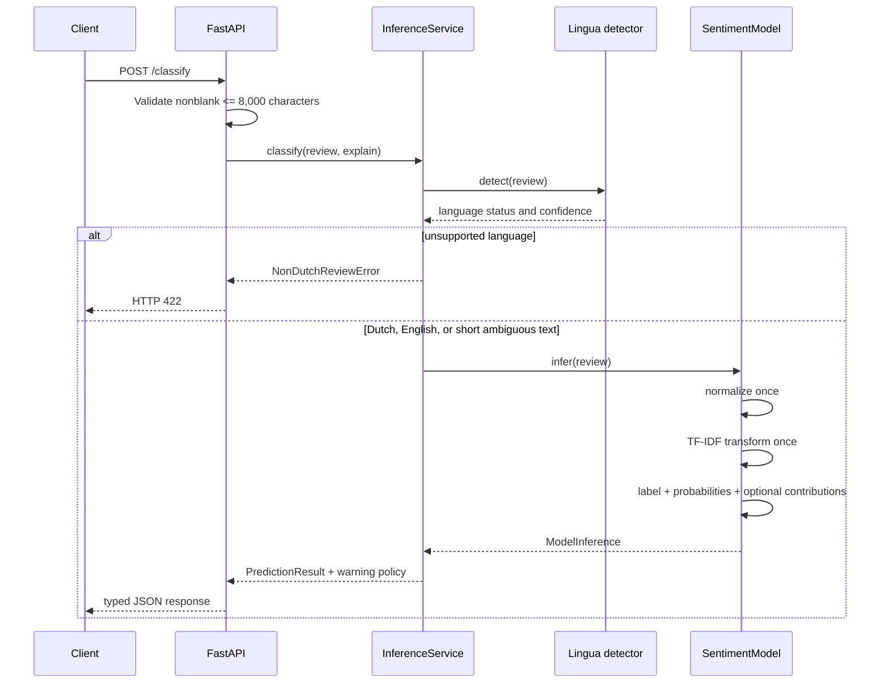
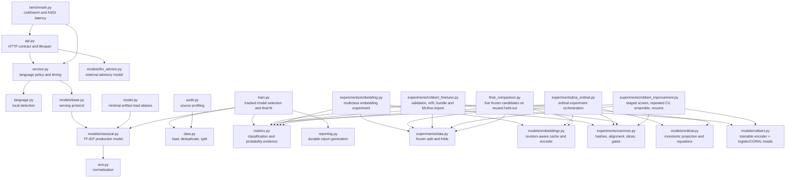
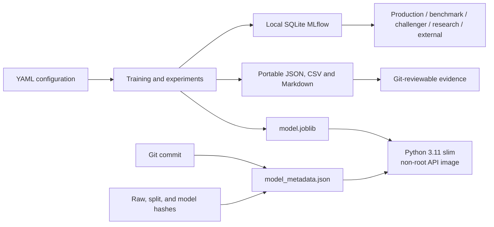
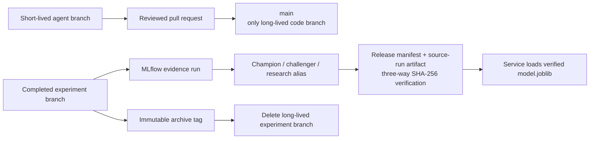

# System Architecture

The repository has one production inference path plus classical, embedding, and transformer
experiment paths. Every path shares immutable data boundaries, normalization, label order, metrics,
and hash verification.

## End-to-end data and model flow

```mermaid
flowchart LR
    raw["Immutable CSV\nReviews + Label"] --> audit["Schema and SHA-256 audit"]
    raw --> language["Local Lingua detection"]
    language --> normalize["Unicode, HTML and whitespace normalization"]
    normalize --> dedupe["Normalized deduplication\nand conflict removal"]
    dedupe --> split["Language x label stratified split\n3,838 train / 960 held-out"]

    split -->|"training rows only"| cv["Fixed 5-fold OOF indices"]
    split -->|"single formal evaluation"| heldout["Held-out evidence"]
    split -->|"fixed fold 0 validation"| robbert["RobBERT v2 fine-tuning\nColab GPU"]
    split -->|"train-only staged search"| robbertv2["RobBERT improvement\n7 screens → top 2"]

    cv --> classical["Word + character TF-IDF\nLogistic Regression candidates"]
    cv --> jina["Revision-pinned Jina embeddings\nresearch-only cache"]
    jina --> multiclass["Multiclass Logistic Regression"]
    jina --> ordinal["Two calibrated ordinal boundaries"]

    classical --> selection["Macro-F1 selection\nminority and stability guardrails"]
    multiclass --> research["OOF research comparison"]
    ordinal --> research
    robbert --> robbertlog["Three-class logistic head"]
    robbert --> robbertord["CORAL ordinal head"]
    robbertlog --> robbertevidence["Full-train refit + one test evaluation\nportable bundle + MLflow"]
    robbertord --> robbertevidence
    robbertv2 --> robustcv["5 folds × 3 seeds\nOOF mean + stability"]
    robustcv --> robbertfinal["3-seed full-train ensemble\none test evaluation"]
    robbertfinal --> evidence
    heldout --> comparison["Frozen seven-model presentation comparison"]
    classical --> comparison
    multiclass --> comparison
    ordinal --> comparison
    comparison --> finalfive["Predictions + metrics + report\nMLflow final-comparison run"]
    selection --> finalfit["Fit selected classical model"]
    finalfit --> heldout
    heldout --> artifact["Trusted model.joblib\nmetadata + metrics + errors"]
    research --> evidence["CSV + JSON + Markdown\nMLflow evidence runs"]
    artifact --> registry["MLflow Registry\nsentiment-production@champion"]
    finalfive --> comparisonapi["GET /model-comparison\nread-only evidence"]
```

The held-out split is not used for embedding or ordinal selection. Later research comparisons that
reuse it are labeled `reused-heldout`; a new blind test is required before challenger promotion.

## Production inference path

The language detector is deliberately outside the serialized sklearn pipeline because it controls
request policy and warnings. Normalization, vectorization, and classification remain together inside
the fitted pipeline to prevent training/serving drift.

## Module ownership

## Artifacts, tracking, and deployment

Docker copies only source code, the trusted production model, metadata, release manifest, and the
bounded presentation-comparison JSON used by the read-only UI table. Raw
data, reports, tests, caches, secrets, notebooks, MLflow state, and training dependencies remain
outside the image. GitHub Actions builds the image, starts the container, verifies health and
classification, and checks that the reported model version matches the release manifest.

## Git and model lifecycle

Model families are separated by packages and configuration, not by permanent Git branches. See
`docs/MODEL_GOVERNANCE.md` for the archived source-to-run mapping and Registry policy.

The runtime deliberately serves the exported file rather than querying MLflow on every startup.
`scripts/manage_model_release.py` proves that the file, metadata, tracked release manifest, Registry
alias, and champion source-run copies agree. This keeps Docker independent of MLflow while preserving
promotion authority in `sentiment-production@champion`.
`make model-release-export` first regenerates the reviewable manifest from the current alias and then
copies the exact source-run artifact; CI performs the file-only verification without needing MLflow.

The browser calls `/recommendations`, which always invokes the formal production classifier and may
also invoke the external `deterministic-24-shot-v1` DeepSeek profile. It uses the exact frozen prompt
from the historical 24-shot evaluation, while the metric shown in `/model-comparison` remains static
evidence from that fixed run. `/model-comparison` reads the tracked bounded result JSON; it never
loads research models. Jina, ordinal, and RobBERT models are not live inference choices. The two
original RobBERT v2 candidates remain test-only evidence. The improvement path keeps one mixed
Dutch/English model, compares explicit token-selection and loss policies using train-only evidence,
and persists every fold/seed trial for Colab resume. Head-tail 512 with mild class weights won
repeated validation; its three-seed ensemble reached test Macro-F1 0.6615. It remains a challenger
evaluation and is not loaded by the service.

## Repository and artifact policy

| Category | Paths | Policy |
| --- | --- | --- |
| Source | `src/`, `tests/`, `scripts/` | Review, lint, test, and version in Git |
| Configuration | `configs/`, `pyproject.toml`, `Makefile`, `Dockerfile` | One canonical configuration per model family; never store secrets |
| Immutable inputs | Supplied CSV and challenge PDF | Never rewrite; verify by hash |
| Production artifacts | `artifacts/model.joblib`, metadata, release manifest | Preserve and verify before serving |
| Durable evidence | Selected JSON/CSV, Markdown reports, final PPTX/PDF | Version only when supporting a documented decision |
| Reproducible outputs | Coverage, renders, inspection output, caches | Ignore and regenerate |
| Local state | `.venv/`, `.cache/`, `mlruns/`, `mlflow.db` | Ignore; back up MLflow independently |
| Sensitive files | `.secrets/` | Ignore; never inspect, package, or commit |

Presentation sources are durable content artifacts; generated slide inspection and render files are
ignored. Model downloads and embedding matrices remain local under `.cache/`. `main` is the only
long-lived branch; completed experiment branches can be removed after an archive tag and MLflow
evidence mapping have been verified.
