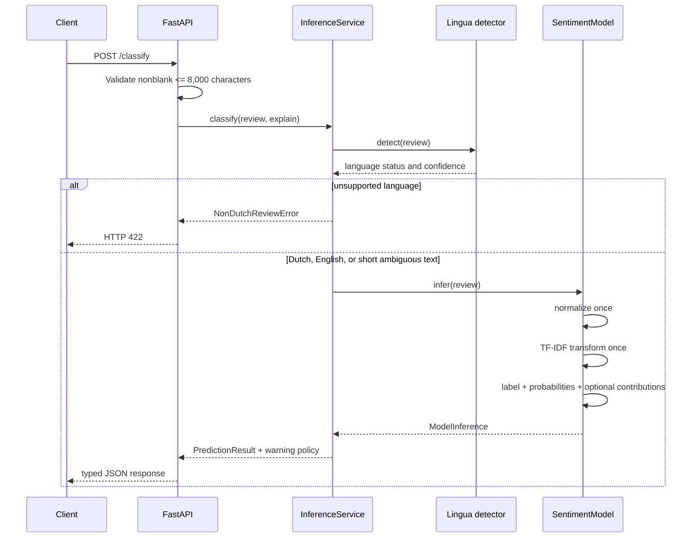
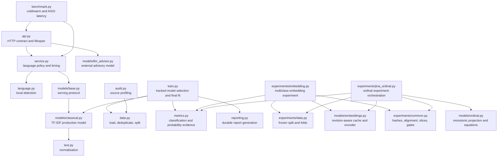
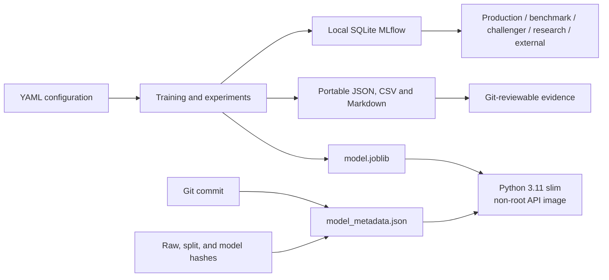
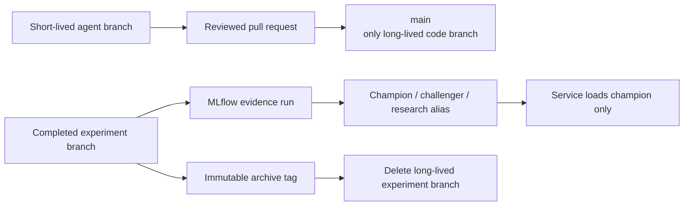

# System Architecture

The repository has one production inference path and two research-only experiment paths. Every path
shares immutable data boundaries, normalization, label order, metrics, and hash verification.

## End-to-end data and model flow

```mermaid
flowchart LR
    raw["Immutable CSV\nReviews + Label"] --> audit["Schema and SHA-256 audit"]
    raw --> language["Local Lingua detection"]
    language --> normalize["Unicode, HTML and whitespace normalization"]
    normalize --> dedupe["Normalized deduplication\nand conflict removal"]
    dedupe --> split["Language x label stratified split\n3,838 train / 960 held-out"]

    split -->|"training rows only"| cv["Fixed 5-fold OOF indices"]
    split -->|"single formal evaluation"| heldout["Held-out evidence"]

    cv --> classical["Word + character TF-IDF\nLogistic Regression candidates"]
    cv --> jina["Revision-pinned Jina embeddings\nresearch-only cache"]
    jina --> multiclass["Multiclass Logistic Regression"]
    jina --> ordinal["Two calibrated ordinal boundaries"]

    classical --> selection["Macro-F1 selection\nminority and stability guardrails"]
    multiclass --> research["OOF research comparison"]
    ordinal --> research
    selection --> finalfit["Fit selected classical model"]
    finalfit --> heldout
    heldout --> artifact["Trusted model.joblib\nmetadata + metrics + errors"]
    research --> evidence["CSV + JSON + Markdown\nMLflow evidence runs"]
    artifact --> registry["MLflow Registry\nsentiment-production@champion"]
```

The held-out split is not used for embedding or ordinal selection. Later research comparisons that
reuse it are labeled `reused-heldout`; a new blind test is required before challenger promotion.

## Production inference path

The language detector is deliberately outside the serialized sklearn pipeline because it controls
request policy and warnings. Normalization, vectorization, and classification remain together inside
the fitted pipeline to prevent training/serving drift.

## Module ownership

## Artifacts, tracking, and deployment

Docker copies only source code, the trusted production model, and model metadata. Raw data, reports,
tests, caches, secrets, notebooks, MLflow state, and training dependencies remain outside the image.
The current environment has no Docker executable, so image execution remains statically reviewed but
not runtime-verified.

## Git and model lifecycle

Model families are separated by packages and configuration, not by permanent Git branches. See
`docs/GIT_MLFLOW_MAPPING.md` for the archived source-to-run mapping.
